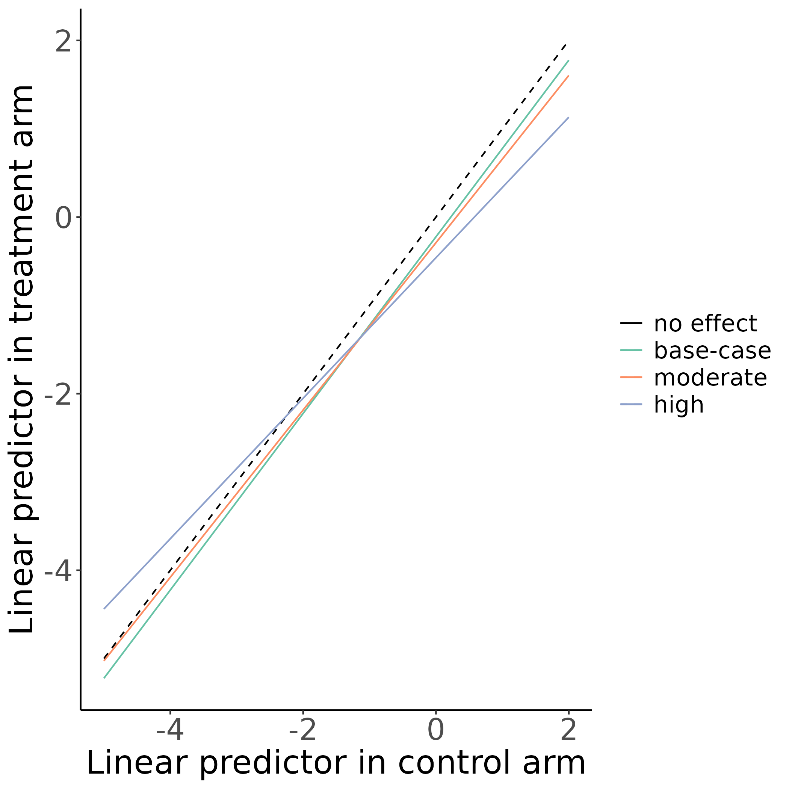
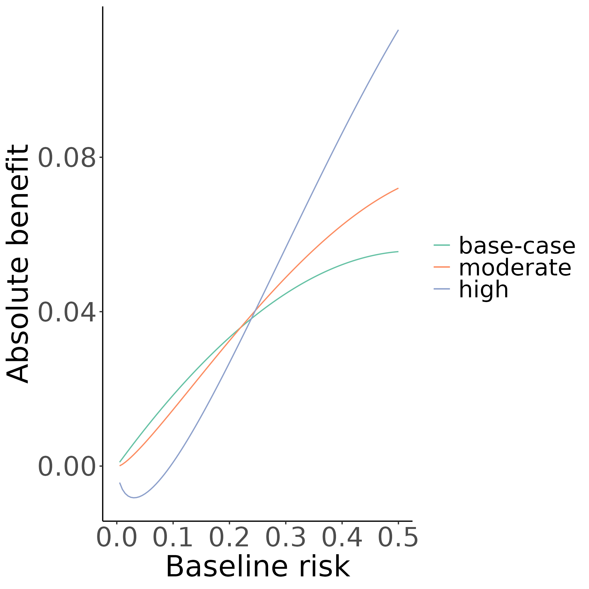

```{r xaringan-themer, include=FALSE, warning=FALSE}
library(xaringanthemer)
style_mono_accent(
  base_color = "#353A47",
  header_font_google = google_font("Candal"),
  text_font_google   = google_font("Sanchez", "300", "300i"),
  code_font_google   = google_font("Fira Mono")
)
```


```{r xaringan-panelset, echo=FALSE}
xaringanExtra::use_panelset()
```

# Subgroup analyses

.panelset[
.panel[.panel-name[General]
* Generalizing overall treatment effects is often problematic
* Subgroup analyses often not adequatel-powered
]
.panel[.panel-name[Categories]

Heterogeneity of treatment effect (HTE) analyses can be one of:
* Confirmatory
* Exploratory
* Descriptive
* **Predictive**

]
]

---

# Predictive approaches to HTE

.panelset[
.panel[.panel-name[Risk-based]
- Reference: risk factors

<br>

- Viable option in the absence of well-established effect modifiers

<br>

- Two-step approaches:
  - Prediction of baseline risk
  - Evalution of treatment effect within risk strata
]
.panel[.panel-name[Treatment effect modeling]
- Reference: Risk factors and effect modifiers

<br>

- High risk of overfitting
]
.panel[.panel-name[Optimal treatment rules]
- Reference: Effect modifiers

<br>

- Focus on development of treatment assignment rules
]
]

---

class: center middle

# Simulation study

---

# Settings

.panelset[
.panel[.panel-name[Notation]
We observe data $(Z, X, Y)$ where:
* $Z_i=0,\ 1$ treatment indicator
* $Y_i=0,\ 1$ outcome
* $X_i$ measured covariates

Let $\{Y_i(z), z=0,\ 1\}$ denote the potential outcomes

<br>

We want to estimate:

$$
\begin{aligned}
\tau(x) &= E\{Y(0)\ |\ X = x\} - E\{Y(1)\ |\ X = x\} \\
& = E\{Y\ |\ X=x, Z=0\} - E\{Y\ |\ X=x, Z=1\}
\end{aligned}
$$

$$\newcommand{\indep}{\perp \!\!\! \perp}$$

since $(Y(0), Y(1)) \indep Z\ |\ X$

]
.panel[.panel-name[Patients]
We observe $x_1,\dots,x_8$, of which $4$ are continuous and $4$ are binary

$$x_1,\dots,x_4 \sim N(0, 1)$$
$$x_5,\dots,x_8 \sim B(1, 0.2)$$

.panel[.panel-name[Controls]
True probabilities if left untreated:

$$\newcommand\given[1][]{\:#1\vert\:}$$
$$P(Y(0) = 1\given X=x) = \text{expit}(lp_0) = \frac{e^{lp_0}}{1 + e^{lp_0}}$$

where $lp_0=lp_0(x)=x^t\beta$
]
]
.panel[.panel-name[Treated]
True probabilities if treated:

$$P(Y(1) = 1\given X=x) = \text{expit}(lp_1) + harm$$

where $lp_1 = \gamma_0 + \gamma_1(lp_0-c)+\gamma_2(lp_0-c)^2$
]

.panel[.panel-name[Scenarios]
* Overall treatment effects: Absent $(OR=1)$, moderate $(OR = 0.8)$, strong $(OR=0.5)$
* Sample size: $N = 4250,\ 1063,\ 17000$
* c-statistic of prediction model: $0.75,\ 0.65,\ 0.85$
* Evolution of treatment effect:
  * constant
  * linear deviations (moderate, strong)
  * quadratic deviations (moderate, strong)
  * non-monotonic deviations
* Treatment-related harms: absent, moderate, strong, negative

<br>
<br>

Total $3\times 3\times 3\times 6\times 4 = 648$ simulation scenarios
]

]

---

# More on deviations

.panelset[
.panel[.panel-name[Linear]
.pull-left[
```{r, eval=TRUE, echo=FALSE, out.width = '80%'}

```
]
.pull-right[
```{r, eval=TRUE, echo=FALSE, out.width = '80%'}

```
]
]
.panel[.panel-name[Quadratic]
.pull-left[
```{r, eval=TRUE, echo=FALSE, out.width = '80%'}
knitr::include_graphics("figures/deviate_quadratic_08.png")
```
]
.pull-right[
```{r, eval=TRUE, echo=FALSE, out.width = '80%'}
knitr::include_graphics("figures/deviate_quadratic_absolute_08.png")
```
]
]
.panel[.panel-name[Non-monotonic]
.pull-left[
```{r, eval=TRUE, echo=FALSE, out.width = '80%'}
knitr::include_graphics("figures/deviate_non_monotonic_08.png")
```
]
.pull-right[
```{r, eval=TRUE, echo=FALSE, out.width = '80%'}
knitr::include_graphics("figures/deviate_non_monotonic_absolute_08.png")
```
]
]
]

---

# Methods to individualize

.panelset[
.panel[.panel-name[Risk model]
Merging treatment arms, we develop prediction models including a constant relative treatment effect:

$$P(Y=1\given X=x,Z=z) = g(x^t\beta + \delta_0 z)$$

We derive baseline risk predictions for patients by setting $Z=0$.

<br>
<br>

The estimated linear predictor of this model is

$$\hat{lp} = lp(x;\hat{\beta}) = x^t\hat{\beta}$$

We make individualized predictions from:
$$\tau(x;\hat{\beta}) = g(f(\hat{lp}, 0)) - g(f(\hat{lp}, 1))$$
]
.panel[.panel-name[Constant]
Constant treatment effect model:
$$f(\hat{lp}, z) = \hat{lp} + \delta_0z$$
with $\hat{\delta}_0$ the estimated relative treatment effect (log odds ratio).
]
.panel[.panel-name[Linear interaction]
Linear interaction of treatment with the linear predictor:

$$ f(\hat{lp}, z) = \delta_0+\delta_1z+\delta_2\hat{lp}+\delta_3z\hat{lp} $$
]
.panel[.panel-name[Smooth]
Predict absolute benefit using smoothing with restricted cubic splines with
$k=3, 4$ and $5$ knots:

$$ f(\hat{lp}, z) = \delta_0 + \delta_1z+zs(\hat{lp}) $$
where

$$s(x)=\alpha_0+\alpha_1h_1(x)+\alpha_2h_2(x)+\dots+\alpha_{k-1}h_{k-1}(x)$$

with $h_1(x)=x$ and for $j=2,\dots,k-2$
$$h_{j+1}(x)= (x-t_j)^3-(x-t_{k-1})_+^3 \frac{t_k-t_j}{t_k-t_{k-1}}+(x-t_k)^3_+\frac{t_{k-1}-t_j}{t_k-t_{k-1}}$$
where 
$t_1,\dots,t_k$ are the selected knots for the restricted cubic splines
]
.panel[.panel-name[Adaptive]
* Adaptive approach using AIC
]
]

---


# Evaluation metrics

* Root mean squared error
$$\text{RMSE}=\sqrt{\frac{1}{n}\sum_{i=1}^n\big(\tau(x_i) - \hat{\tau}(x_i)\big)^2}$$

<br>

* Discrimination for benefit (C-for-benefit)
> The probability
> that from two randomly chosen matched patient pairs with unequal observed
> benefit, the pair with greater observed benefit also has a higher predicted
> benefit

<br>

* Calibration for benefit (E-for-benefit)
> The observed benefits are regressed on
> the predicted benefits using a locally weighted scatterplot smoother (loess).
> The E-for-benefit is the average absolute difference between predicted and
> smooth observed benefit. Values closer to $0$ represent better calibration.

---


class: center middle

# Results

---

# Results (RMSE)

.panelset[
.panel[.panel-name[Base]
.center[
```{r, eval=TRUE, echo=FALSE, cache = FALSE, out.width = '50%'}
knitr::include_graphics("figures/rmse_moderate_base.png")
```
]
]
.panel[.panel-name[AUC]
.center[
```{r, eval=TRUE, cache = FALSE, echo=FALSE, out.width = '50%'}
knitr::include_graphics("figures/rmse_moderate_auc.png")
```
]
]
.panel[.panel-name[Sample size]
.center[
```{r, eval=TRUE, cache = FALSE, echo=FALSE, out.width = '50%'}
knitr::include_graphics("figures/rmse_moderate_sample_size.png")
```
]
]
]

---

# Results (Adaptive selection)

.panelset[
.panel[.panel-name[Base]
.center[
```{r, eval=TRUE, cache = FALSE, echo=FALSE, out.width = '68%'}

```
]
]
.panel[.panel-name[Sample size]
.center[
```{r, eval=TRUE, cache = FALSE, echo=FALSE, out.width = '68%'}

```
]
]
]

---

# Results (Discrimination)

.panelset[
.panel[.panel-name[Base]
.center[
```{r, eval=TRUE, cache = FALSE, echo=FALSE, out.width = '58%'}
knitr::include_graphics("figures/discrimination_moderate_base.png")
```
]
]
.panel[.panel-name[AUC]
.center[
```{r, eval=TRUE, cache = FALSE, echo=FALSE, out.width = '58%'}
knitr::include_graphics("figures/discrimination_moderate_auc.png")
```
]
]
.panel[.panel-name[Sample size]
.center[
```{r, eval=TRUE, cache = FALSE, echo=FALSE, out.width = '58%'}
knitr::include_graphics("figures/discrimination_moderate_sample_size.png")
```
]
]
]

---

# Results (Calibration)

.panelset[
.panel[.panel-name[Base]

.center[
```{r, eval=TRUE, cache = FALSE, echo=FALSE, out.width = '58%'}
knitr::include_graphics("figures/calibration_moderate_base.png")
```
]
]
.panel[.panel-name[AUC]
.center[
```{r, eval=TRUE, cache = FALSE, echo=FALSE, out.width = '58%'}
knitr::include_graphics("figures/calibration_moderate_auc.png")
```
]
]
.panel[.panel-name[Sample size]
.center[
```{r, eval=TRUE, cache = FALSE, echo=FALSE, out.width = '58%'}
knitr::include_graphics("figures/calibration_moderate_sample_size.png")
```
]
]
]

---

class: center middle

# Data application

---

# GUSTO-I

.panelset[
.panel[.panel-name[Data]
* Total of 30,510 patients with MI
* 10,348 patients randomized to tissue plasminogen activator (tPA)
* 20,162 patients randomized to streptokinase
* _Outcome_: 30-day mortality

<br>

* Logistic regression model with 6 covariates:
  * age
  * Killip class
  * systolic blood pressure
  * heart rate
  * previous MI
  * location of MI

]
.panel[.panel-name[Predicted benefit]
.center[
```{r, eval=TRUE, echo=FALSE, cache = FALSE, out.width = '58%'}
knitr::include_graphics("figures/gusto.png")
```
]
]
]

---

class: center middle

# Conclusions


---

# Conclusions

* The linear interaction model is a viable option with smaller sample size and/or moderately performing risk prediction models

<br>

* RCS-3 is a better option when non-monotonic deviations from a constant treatment effect and/or substantial treatment-related harms are anticipated

<br>

* Increasing the number of RCS knots does not translate to improved benefit prediction

<br>

* An adaptive AIC approach is a viable option with larger sample sizes---quite conservative with smaller samples

---

# Links

* All the code for the simulations can be found at:
https://github.com/rekkasa/arekkas_HteSimulation_XXXX_2021

<br>

* All the simulation results can be explored using a shiny application:
https://arekkas.shinyapps.io/simulation_viewer/
