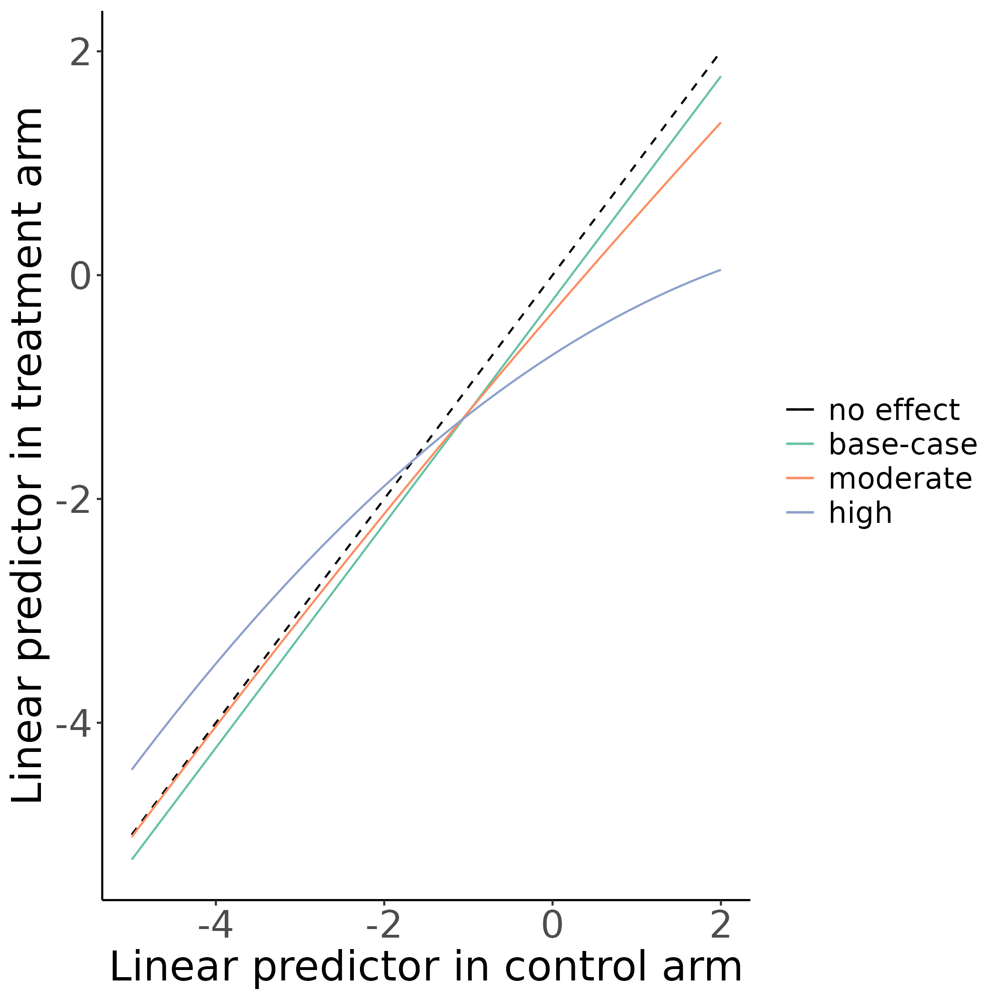
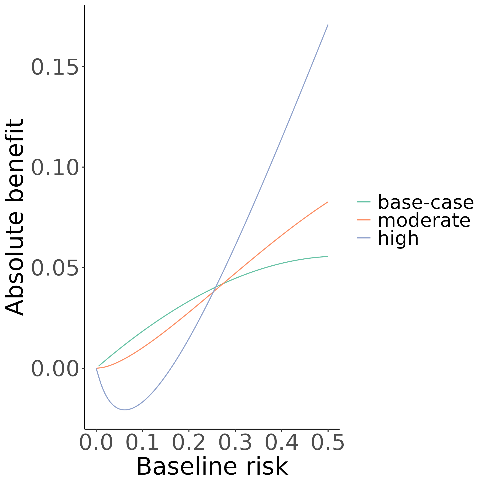
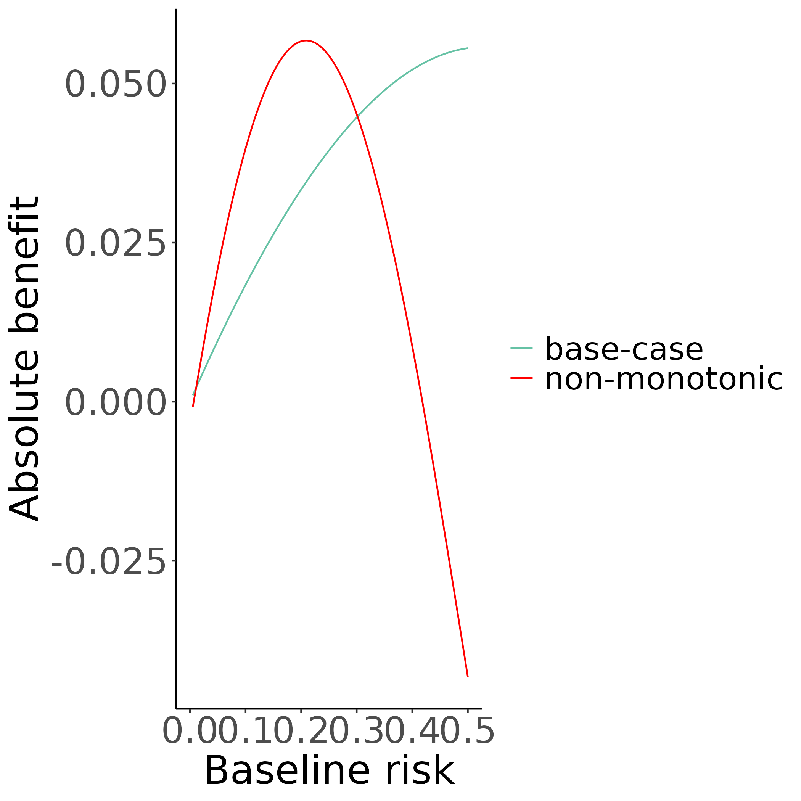

```{r xaringan-panelset, echo=FALSE}
xaringanExtra::use_panelset()
```

# Predictive approaches to HTE

.panelset[
.panel[.panel-name[Risk-based]
- Reference: risk factors
- Viable option in the absence of well-established effect modifiers
- Two-step approaches:
  - Prediction of baseline risk
  - Evalution of treatment effect within risk strata
]
.panel[.panel-name[Treatment effect modeling]
- Reference: Risk factors and effect modifiers
- High risk of overfitting
]
.panel[.panel-name[Optimal treatment rules]
- Reference: Effect modifiers
- Focus on development of treatment assignment rules
]
]

---

class: center middle

# Simulation study

---

# Settings

.panelset[
.panel[.panel-name[Patients]
For each patient we simulated 8 baseline covariates:
- $X_1, \dots, X_4$ were continuous (standard normal) 
- $X_5,\dots,X_8$ were binary with 20% prevalence 
- Treatment ( $T$ ) was allocated using a 50:50 split
]
.panel[.panel-name[Baseline risk]
.pull-left[
For the _base-case_ scenario
- AUC: 0.75
- Event rate: 20%
]
.pull-right[
_Deviation_ scenarios:
- High AUC (0.85)
- Low AUC (0.65)
- Event rate: fixed at 20%
]
<br>
<br>
<br>

> &#9964; All covariates were risk factors <br>
>
&#9964; In all simulation runs a correctly-specified logistic regression model was used
>

]
.panel[.panel-name[Treatment effect]
_Base-case_ scenario: constant relative treatment effect (OR = 0.8)

<br>

_Deviation_ scenarios:
- Effect size (absent, stronger)
- Linear and non-linear deviations
- Treatment-related harms
]
]

---

# More on deviations

.panelset[
.panel[.panel-name[Linear]
.pull-left[
```{r, eval=TRUE, echo=FALSE, out.width = '80%'}
knitr::include_graphics("figures/deviate_linear_08.png")
```
]
.pull-right[
```{r, eval=TRUE, echo=FALSE, out.width = '80%'}
knitr::include_graphics("figures/deviate_linear_absolute_08.png")
```
]
]
.panel[.panel-name[Quadratic]
.pull-left[
```{r, eval=TRUE, echo=FALSE, out.width = '80%'}

```
]
.pull-right[
```{r, eval=TRUE, echo=FALSE, out.width = '80%'}

```
]
]
.panel[.panel-name[Non-monotonic]
.pull-left[
```{r, eval=TRUE, echo=FALSE, out.width = '80%'}

```
]
.pull-right[
```{r, eval=TRUE, echo=FALSE, out.width = '80%'}

```
]
]
]

---

# Methods to individualize

* A constant treatment effect

<br>

* Stratification

<br>

* Linear interaction of treatment with the linear predictor

<br>

* Interaction of treatment with the linear predictor using restricted cubic splines

<br>

* Adaptive approach using AIC

---

# Evaluation metrics

* Root mean squared error
$$\text{RMSE}=\sqrt{\frac{1}{n}\sum_{i=1}^n\big(\tau(x_i) - \hat{\tau}(x_i)\big)^2}$$

<br>

* Discrimination for benefit
> The probability
> that from two randomly chosen matched patient pairs with unequal observed
> benefit, the pair with greater observed benefit also has a higher predicted
> benefit

<br>

* Calibration for benefit
> The observed benefits are regressed on
> the predicted benefits using a locally weighted scatterplot smoother (loess).
> The ICI-for-benefit is the average absolute difference between predicted and
> smooth observed benefit. Values closer to $0$ represent better calibration.

---

# Results (RMSE)

.panelset[
.panel[.panel-name[Base]
```{r, eval=TRUE, echo=FALSE, out.height = '100%'}
knitr::include_graphics("figures/rmse_moderate_base.png")
```
]
.panel[.panel-name[AUC]
```{r, eval=TRUE, echo=FALSE, out.height = '100%'}
knitr::include_graphics("figures/rmse_moderate_auc.png")
```
]
.panel[.panel-name[Sample size]
```{r, eval=TRUE, echo=FALSE, out.height = '100%'}
knitr::include_graphics("figures/rmse_moderate_sample_size.png")
```
]
]

---

# Results (Discrimination)

.panelset[
.panel[.panel-name[Base]
```{r, eval=TRUE, echo=FALSE, out.height = '100%'}
knitr::include_graphics("figures/discrimination_moderate_base.png")
```
]
.panel[.panel-name[AUC]
```{r, eval=TRUE, echo=FALSE, out.height = '100%'}
knitr::include_graphics("figures/discrimination_moderate_auc.png")
```
]
.panel[.panel-name[Sample size]
```{r, eval=TRUE, echo=FALSE, out.height = '100%'}
knitr::include_graphics("figures/discrimination_moderate_sample_size.png")
```
]
]

---

# Results (Calibration)

.panelset[
.panel[.panel-name[Base]
```{r, eval=TRUE, echo=FALSE, out.height = '100%'}
knitr::include_graphics("figures/calibration_moderate_base.png")
```
]
.panel[.panel-name[AUC]
```{r, eval=TRUE, echo=FALSE, out.height = '100%'}
knitr::include_graphics("figures/calibration_moderate_auc.png")
```
]
.panel[.panel-name[Sample size]
```{r, eval=TRUE, echo=FALSE, out.height = '100%'}
knitr::include_graphics("figures/calibration_moderate_sample_size.png")
```
]
]

---

# GUSTO-I

.panelset[
.panel[.panel-name[Data]
* Total of 30,510 patients with MI
* 10,348 patients randomized to tissue plasminogen activator (tPA)
* 20,162 patients randomized to streptokinase
* _Outcome_: 30-day mortality

<br>

* Logistic regression model with 6 covariates:
  * age
  * Killip class
  * systolic blood pressure
  * heart rate
  * previous MI
  * location of MI

]
.panel[.panel-name[Predicted benefit]
```{r, eval=TRUE, echo=FALSE, out.height = '100%'}
knitr::include_graphics("figures/gusto.png")
```
]
]

---

# Conclusions

* Linear interaction model is a viable option with smaller sample size and/or moderately performing risk prediction models

<br>

* RCS-3 is a better option when non-monotonic deviations from a constant treatment effect and/or substantial treatment-related harms are anticipated

<br>

* Increasing the number of RCS knots does not translate to improved benefit prediction

<br>

* An adaptive AIC approach is a viable option with larger sample sizes---quite conservative with smaller samples

---

# Links

* All the code to the simulations can be found at:
https://github.com/rekkasa/arekkas_HteSimulation_XXXX_2021

<br>

* All the simulation can be explored using a shiny application:
https://arekkas.shinyapps.io/simulation_viewer/
